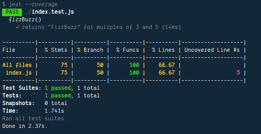

# TDD Dengan Jest

**Write The Test First**.

Tdd bermaksud menulis test terlebih dahulu sehingga menghidari error yang berkepanjangan dan mengharapkan hasil yang diinginkan.

Jest berjalan di Nodejs bukan di browser.

## Langkah - Langkah

### Tambahkan Jest ke dalam project kita

```cmd
  yarn add jest@23.0.6 -d
```

### Esekusi Jest

Untuk mengesekusi test dengan jest dapat melalui.

```cmd
  npx jest
```

Atau membuat runner script di package.json bagian prop test.

```json
  ...
  "scripts": {
    "test": "jest"
  }
  ...
```

### Membuat Test

Contoh membuat test dapat di liat di folder test-driven-fizzbuzz.

greeting.test.js

```js
const greeting = guest => `Hello, ${guest}!`;

describe('greeting()', () => {
  it('says hello', () => {
    expect(greeting('Jest')).toBe('Hello, Jest!');
  });
});

```

**Catatan**.

- describe() -> deklarasikan test suite ('pengelompokan test)
- it() -> deklarsikan test apa  yang ingin dikerjakan
- expect() -> yang diharapkan dari (isi dengan fungsi yang dipanggil)
- toBe() -> matcher hasil yang diharapkan

**Aturan**.

Test suite haruslah menggunakan nama benda (noun).

It() atau test yang diinginkan deklariskan dengan kata kerja (verb).

Sehingga contoh penulisannya menjadi **salam() ucapkan hello**.

### Mengawasi Perubahan file Test

Kita dapat mengawasi perubahan file test dari Jest dengan cara menajalankan perintah ini.

```cmd
  npx jest --watchAll
```

### Melihat Pencakupan Test

Untuk melihat seberapa persentasi test dilaukan dalam kode program, kita bisa mengetikan perintah

```cmd
  jest --coverage
```

sedangkan untuk menampilkan dalam bentuk ouput file text hanya perlu  menambahkan

```cmd
  jest --coverage ​​--coverageReporters=text​
```



pada gambar diatas menjelaskan

1. stmsts -> artinya 75% statments mencakup
2. branch -> if else yang mencakup 50%

yang artinya test belum mencakup semua 100%.

